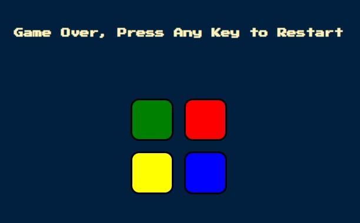

# Simon Game

A classic interactive memory game built with HTML, CSS, and JavaScript. Test your memory by following the ever-growing color sequence!

## Preview



## About the Game

The Simon Game is a fun and challenging memory game where players must follow an increasingly longer sequence of colors and sounds. Each round, the game adds a new color to the sequence, and you must repeat the entire sequence perfectly to advance to the next level.

### How to Play

1. **Start the Game**: Press any key on your keyboard to begin
2. **Watch the Sequence**: The game will flash a color and play a sound
3. **Repeat the Pattern**: Click on the colored buttons in the same order as the sequence
4. **Progress**: Each level adds a new color to the sequence
5. **Game Over**: If you click the wrong sequence, the game ends. Press any key to restart

### Game Features

- 🎮 **Interactive Buttons**: Four colorful buttons (red, blue, green, yellow) that respond to clicks
- 🔊 **Sound Effects**: Each color has its own unique sound
- 📈 **Progressive Difficulty**: The sequence gets longer with each level
- 🎯 **Level Tracking**: Your current level is displayed on screen
- 🔄 **Responsive Feedback**: Visual and audio feedback for every action

## Technologies Used

- **HTML5**: Structure and layout
- **CSS3**: Styling and animations
- **JavaScript**: Game logic and interactivity
- **jQuery**: DOM manipulation and event handling

## Project Structure

```
Simon-Game/
├── index.html       # Main HTML file
├── game.js          # Game logic and functionality
├── styles.css       # Styling and animations
├── images/          # Game images and preview
│   └── Preview.jpg  # Project preview image
├── sounds/          # Audio files for game sounds
└── README.md        # This file
```

## Installation

1. Clone the repository:

   ```bash
   git clone https://github.com/wailhassan/Simon-Game.git
   ```

2. Navigate to the project directory:

   ```bash
   cd Simon-Game
   ```

3. Open `index.html` in your web browser and start playing!

## How to Improve Your Score

- 🧠 Focus and concentrate on the sequence
- 📝 Try to identify patterns in the sequence
- ⏰ Start slow and gradually increase your speed
- 🎯 Practice regularly to improve your memory

## Future Enhancements

- Add difficulty levels (Easy, Medium, Hard)
- Implement a leaderboard to track high scores
- Add more color options for advanced gameplay
- Mobile-friendly touch controls
- Score persistence with local storage

## Author

**WailHassan**

- GitHub: [https://github.com/wailhassan](https://github.com/wailhassan)

---

**Enjoy playing and challenge yourself to beat your high score!** 🎮✨
